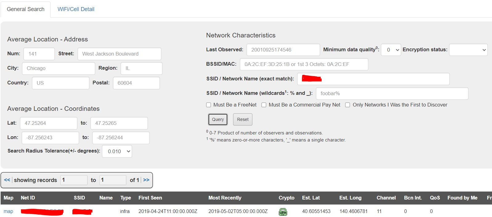

# Sakura
Use a variety of OSINT techniques to solve [this room](https://tryhackme.com/room/sakura) created by the OSINT Dojo.

## [TASK 1, INTRODUCTION]
Read Background and Instructions sections.

--- 

## [TASK 2, TIP-OFF]
Read Background and Instructions sections.

### [What username does the attacker go by?]
You can find the answer by looking at metadata of the given [svg](https://raw.githubusercontent.com/OsintDojo/OsintDojo.github.io/d846483eb41dd4fdb6d00ac84ecdb4a66be6a191/TryHackMe/Sakura/sakurapwnedletter.svg) used by the attacker
    
    Export-filename:	/home/{REDACTED}/Desktop/pwnedletter.png

---

## [TASK 3, RECONNAISSANCE]
Read Background and Instructions sections.

You can use search engines or tools like [sherlock](https://github.com/sherlock-project/sherlock) to find other social media of the id that you found from the last task. (Be careful of results from tools, they may be false positives)

Finally, you will find her LinkedIn and GitHub accounts.

### [What is the full email address used by the attacker?]
There is a PGP repository on her GitHub page and a public key that you can get information from that.
[Additional resource](http://www.macfreek.nl/memory/Analysing_PGP_Identities)

### [What is the attacker's full real name?]
You can find that on her LinkedIn page.

---

## [TASK 4, UNVEIL]
Read Background and Instructions sections.

### [What cryptocurrency does the attacker own a cryptocurrency wallet for?] and [What is the attacker's cryptocurrency wallet address?]
By searching her GitHub profile and her commits you will find a repository and a wallet address.

### [What mining pool did the attacker receive payments from on January 23, 2021 UTC?] and [What other cryptocurrency did the attacker exchange with using their cryptocurrency wallet?]

You can see transactions of the wallet on https://etherscan.io/ 

---

## [TASK 5]
Read Background and Instructions sections.

### [What is the attacker's current Twitter handle?]
You should see the second ID of her from the given [photo](https://raw.githubusercontent.com/OsintDojo/OsintDojo.github.io/main/TryHackMe/Sakura/taunt.png).

After searching the second ID on twitter, you will find her.

### [What is the URL for the location where the attacker saved their WiFi  SSIDs and passwords?]
There is a interesting tweet ...

As you can see, she wrote the words "DEEP" and "PASTE" in uppercase letters for some hints.

Deep Paste is a dark web site for sharing texts. Public pastes are listed in a public database but private ones are only accessible with the correct URL/MD5.

MD5 of her deep paste is given in her tweet.

[Deep Paste Site](http://depastedihrn3jtw.onion/)

### [What is the BSSID for the attacker's Home WiFi?]
You can see her saved WiFi and passwords and you can use wigle.net to find BSSID with their names. (You should sign up to use advanced search)

You can also find her city name by her saved WiFi names!

---

## [TASK 6, HOMEBOUND]
Read Background and Instructions sections.

This task took me and my friends a couple of hours :) 

### [What airport is closest to the location the attacker shared a photo from prior to getting on their flight?]

You can see Washington monument in this picture. So you should search for nearest airport to that and enter IATA code of it.

### [What airport did the attacker have their last layover in?]

You should find that by the information given in one of her tweets:

Maybe searching for JAL Sakura Lounge? :D (There are some airports for that, but the one near Tokyo is the answer)

### [What lake can be seen in the map shared by the attacker as they were on their final flight home?]

You should answer the next question first, then using google map and finding routes of airlines from her last place and her home, You will find the answer.

### [What city does the attacker likely consider "home"?]

You can answer this question by information you found in deeppaste site.

---

special thanks to my [teammate](https://github.com/l14ck3r0x01) ❤️

